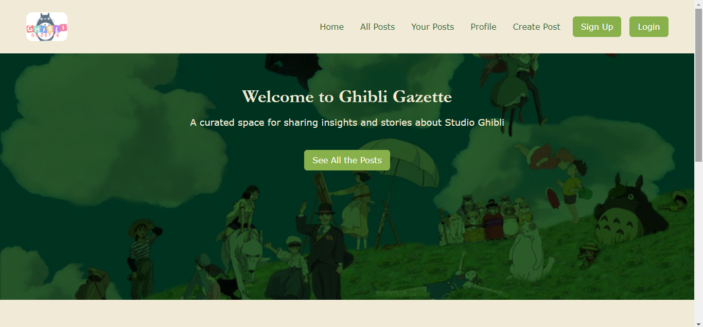

Here’s the updated `README.md` file for **Ghibli Gazette** with the added features:

---

# Ghibli Gazette

Ghibli Gazette is a web application A curated space for sharing insights and stories about Studio Ghibli(Famous Japanese Animation Company)
.
 <!-- Add your project image here -->

 <!-- Add your project image here -->

## Features

- User-friendly interface with responsive design
- Any user can log in, create their own profile, can also edit and delete their profile
- Users can create, edit, and delete their own posts
- Users can also interact with other user's post like can Read the posts, can see the user's Details on top of every post

## Technologies Used

- HTML, CSS, JavaScript
- Django (Python)
- Tailwind CSS

## Installation

To get started with the Ghibli Gazette project locally, follow these steps:

### 1. Clone the Repository

Clone the repository to your local machine:

```bash
git clone https://github.com/yourusername/ghibli-gazette.git
cd ghibli-gazette
```

### 2. Set Up a Virtual Environment

It’s recommended to use a virtual environment to manage project dependencies:

```bash
python -m venv venv
```

Activate the virtual environment:

- **On Windows:**

  ```bash
  venv\Scripts\activate
  ```

- **On macOS/Linux:**

  ```bash
  source venv/bin/activate
  ```

### 3. Install Dependencies

Install the required Python packages using the `requirements.txt` file:

```bash
pip install -r requirements.txt
```

### 4. Configure the `.env` File

Create a `.env` file in the root directory of the project with the following content:

```env
DJANGO_SECRET_KEY=your_secret_key
DEBUG=True
```

Replace `your_secret_key` with a secure, random key. Adjust other values as needed.

### 5. Run Migrations

Apply database migrations to set up your database schema:

```bash
python manage.py migrate
```

### 6. Run the Development Server

Start the Django development server:

```bash
python manage.py runserver
```

Navigate to `http://127.0.0.1:8000/` in your browser to view the application.


## License

This project is licensed under the MIT License - see the [LICENSE](LICENSE) file for details.

